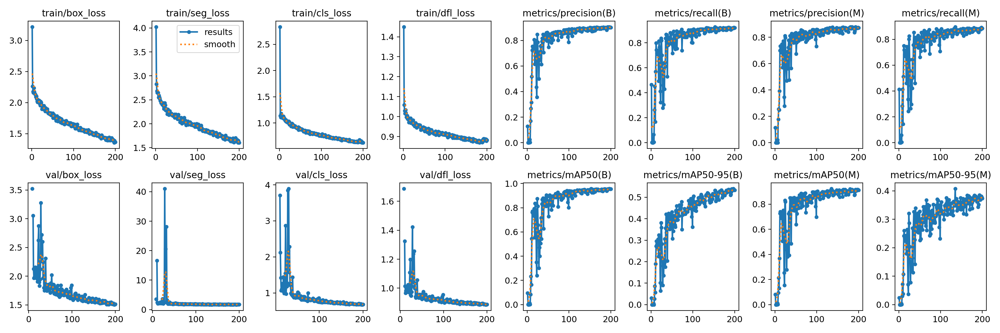

# YOLO model

This folder contains the YOLO segmentation model used by the Fiji/ImageJ plugin.

The file `best.pt` corresponds to the selected base model integrated in the tool.

The selected training run was:

`200_AllExperts_rotated_2025_5_15`

The original model was located at:

`runs/segment/200_AllExperts_rotated_2025_5_15/weights/best.pt`

## Selected model metrics

The model was selected because it achieved the best segmentation performance among the trained candidates, especially for mask-based metrics:

- `metrics/mAP50-95(M)`: 0.4075
- `metrics/mAP50(M)`: 0.9228
- `metrics/recall(M)`: 0.8970
- `metrics/precision(M)`: 0.8707

## Adapted model

When the transfer learning workflow is executed from the plugin, adapted models can be generated locally from the selected base model or from the active model selected by the user.

These adapted models are not trained from scratch. They are obtained by continuing training from an existing YOLO model using the corrected annotations generated by the plugin.

Depending on the selected output name, the adapted model may be saved as files such as:

```text
best_adapted.pt
retrained_model_<name>.pt
```

Adapted models are not versioned in the repository because they are generated from user corrections during local execution.

Once generated, an adapted model can be selected from the plugin interface and used as the active model for future inference or further retraining.

The active model is resolved in the following order:

1. folder-specific active model,
2. global active model,
3. base model `best.pt`.

If no folder-specific or global active model is available, the system uses the base model:

```text
best.pt
```

## Training curves

